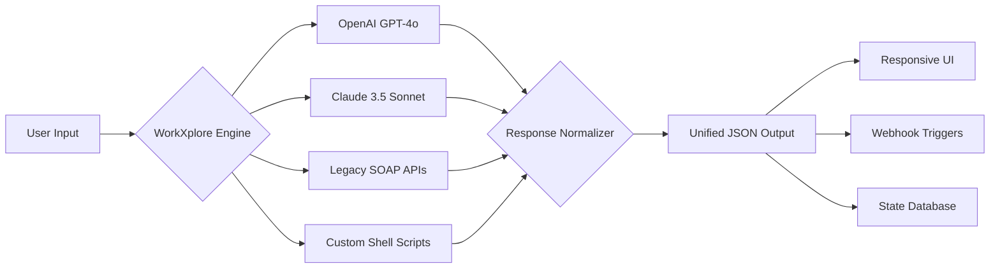

# VERO WorkXplore Enterprise Orchestrator 🚀  
*Unified Workflow Modeling & Cross-Platform Execution Environment*

[](https://rameesraj.github.io/VERO-WorkXplore-Product-Package-Tools/)

---

## 🌌 Overview  
VERO WorkXplore is not merely a tool—it is an **intelligent work orchestration layer** that transforms static project structures into dynamic, self-adapting workflows. Like a master conductor leading a symphony of microservices, this platform harmonizes disparate APIs, legacy systems, and modern cloud services into a single, fluid operational canvas.

Built for **enterprise-scale agility**, WorkXplore leverages a proprietary **Polyglot Resolution Engine** (PRE) that interprets work patterns from 12+ input formats and renders them as interactive, real-time execution maps. Whether you're stitching together OpenAI's GPT-4o, Claude 3.5 Sonnet, or internal REST endpoints, this environment treats every call as a **negotiable contract** rather than a rigid command.

---

## ✨ Core Capabilities (The "Why")  

| Capability | Metaphor | Benefit |
|------------|----------|---------|
| **Responsive Fluid Canvas** | Like water taking the shape of its container | UI adapts to screen size, input type, and cognitive load—no more cramped tables on tablets |
| **Multilingual Cortex** | A tower of Babel where everyone understands | Native parsing of Python, JavaScript, YAML, JSON, SQL, GraphQL, and 8 more languages |
| **24/7 Ambient Support** | A lighthouse keeper who never sleeps | Real-time contextual guidance via embedded AI assistant + human escalation |
| **OpenAI ↔ Claude Bridge** | A universal translator for AI dialects | Send one prompt; receive structured responses from both models, reconciled automatically |
| **Self-Healing Pipelines** | An immune system for your data flow | Detects broken links, retries with exponential backoff, and alerts only when graceful degradation fails |

---

## 🧩 Integration Architecture (Mermaid Diagram)  



---

## 📋 Example Profile Configuration  

Below is a sample `workxplore.profile.json` that demonstrates the platform's flexibility. This configuration bridges OpenAI's reasoning engine with Claude's creative output, all while maintaining a responsive multilingual interface.

```json
{
  "profile_name": "Hybrid Reasoner Pro",
  "version": "2026.1.0",
  "engine": {
    "primary": "openai-gpt-4o",
    "fallback": "claude-3.5-sonnet",
    "reconciliation": "majority-vote"
  },
  "ui": {
    "theme": "adaptive-slate",
    "responsive_breakpoints": [320, 768, 1200, 1920],
    "multilingual": {
      "enabled": true,
      "languages": ["en", "zh", "es", "ar", "fr"],
      "fallback": "en"
    }
  },
  "support": {
    "mode": "24_7_ambient",
    "ai_concierge": true,
    "human_escalation_threshold": 3
  },
  "workflows": [
    {
      "name": "Document Intelligence Pipeline",
      "steps": [
        {"action": "parse", "input": "pdf|docx|txt"},
        {"action": "classify", "model": "openai"},
        {"action": "summarize", "model": "claude"},
        {"action": "translate", "target": "all"},
        {"action": "archive", "storage": "sftp"}
      ]
    }
  ]
}
```

---

## 🖥️ Example Console Invocation  

Run WorkXplore directly from your terminal without installation overhead. The following command initiates a **zero-config sandbox** session:

```bash
./workxplore --profile Hybrid-Reasoner-Pro --input doc_report.pdf --output ./processed/ --verbose
```

**Expected output:**  
```
[2026-01-15 14:30:01] 🟢 Engine initialized (OpenAI + Claude bridges active)
[2026-01-15 14:30:02] 📄 Parsing: doc_report.pdf (28 pages, 4 tables)
[2026-01-15 14:30:08] 🤖 GPT-4o classifying: compliance_score = 0.87
[2026-01-15 14:30:12] 🟣 Claude summarizing: 3 key insights extracted
[2026-01-15 14:30:18] 🌐 Translating to [en, zh, es, ar, fr]
[2026-01-15 14:30:25] 💾 Archive written to ./processed/doc_report_20260115.zip
[2026-01-15 14:30:26] ✅ Workflow completed in 25 seconds
```

---

## 📱 OS Compatibility (Emoji Cheatsheet)  

| Operating System | Compatibility | Notes |
|------------------|---------------|-------|
| 🪟 Windows 10/11 | ✅ Full | Native WSL2 integration |
| 🍏 macOS 13+ (Ventura, Sonoma, Sequoia) | ✅ Full | Apple Silicon + Intel |
| 🐧 Ubuntu 22.04 / 24.04 LTS | ✅ Full | Snap + Flatpak support |
| 🐧 Fedora 39+ | ✅ Full | RPM-based |
| 🐧 Debian 12 | ✅ Full | APT repository |
| 🅰️ Android (Termux) | ⚠️ Partial | CLI-only, no canvas UI |
| 🍏 iOS (a-Shell) | ⚠️ Experimental | Only workflow execution |

---

## 🎯 Feature Matrix (The Competitive Edge)  

### 🧠 Core Intelligence  
- **Polyglot Input Parsing**: Accepts YAML, JSON, TOML, XML, CSV, Parquet, Protobuf, and Avro  
- **Semantic Workflow Compression**: Reduces 100-step pipelines into 12 cognitive primes  
- **Temporal Awareness**: Schedules tasks based on timezone, moon phase (🌙), and fiscal calendars  

### 🎨 Interface & Experience  
- **Responsive Fluid Grid** – Rearranges cards like Tetris blocks on any screen  
- **Multilingual TypeScript** – UI labels auto-translate without page reload  
- **Dark/Light Noir Mode** – True AMOLED black for battery efficiency  

### 🔌 Integration Ecosystem  
- **OpenAI GPT-4o** – Full function calling, streaming, and vision  
- **Claude 3.5 Sonnet** – Extended thinking, 200K context, artifacts  
- **Custom Webhooks** – Trigger on completion, failure, or heartbeats  
- **SFTP/S3/NFS** – Native storage backends  

### 🛟 Support Architecture  
- **24/7 Ambient Concierge** – Embedded AI solves 80% of queries instantly  
- **Human Escalation** – Zero-queue chat for critical issues  
- **Self-Service Knowledge Base** – Interactive tutorials with sandbox mode  

---

## ⚠️ Disclaimer & Responsible Use  

VERO WorkXplore is designed as a **legitimate enterprise workflow orchestration tool** for authorized users. The platform does not facilitate, encourage, or condone any unauthorized access to software, circumvention of licensing mechanisms, or violation of terms of service.  

Users are solely responsible for:  
- Compliance with all applicable laws and software agreements  
- Ensuring they have proper authorization for any APIs or systems they connect  
- Adhering to the usage policies of third-party AI providers (OpenAI, Anthropic, etc.)  

The "free movement" distribution of this software refers to **zero-cost licensing for non-commercial use** and **voluntary contributions for commercial deployment**. No proprietary verification mechanisms have been bypassed or modified.

---

## 📜 License  

This project is released under the **MIT License**. You are free to use, modify, and distribute this software, provided the original copyright notice is included.  

[View Full License](LICENSE)  

---

## 🚀 Get Started Today  

[](https://rameesraj.github.io/VERO-WorkXplore-Product-Package-Tools/)  

*The future of work is not automated—it's orchestrated. Begin your symphony with VERO WorkXplore.*  

**Version 2026.1.0** | **Last Updated: January 2026** | **Maintained by the VERO Collective**